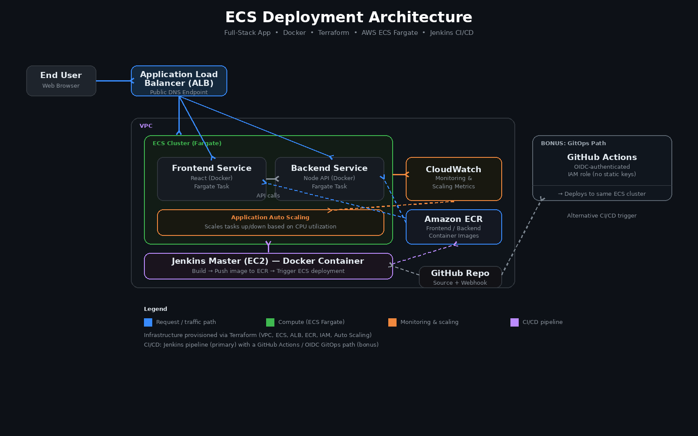
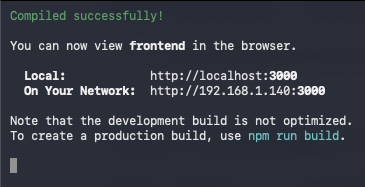
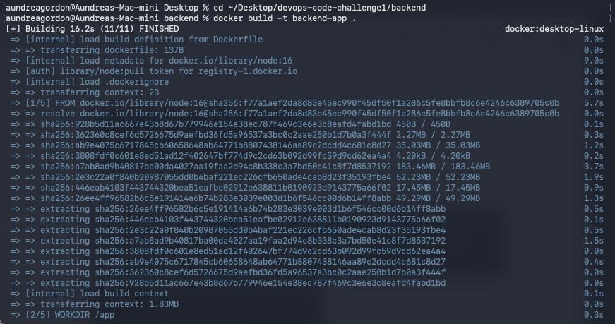
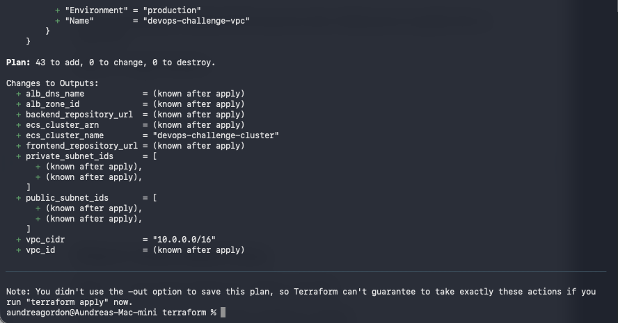
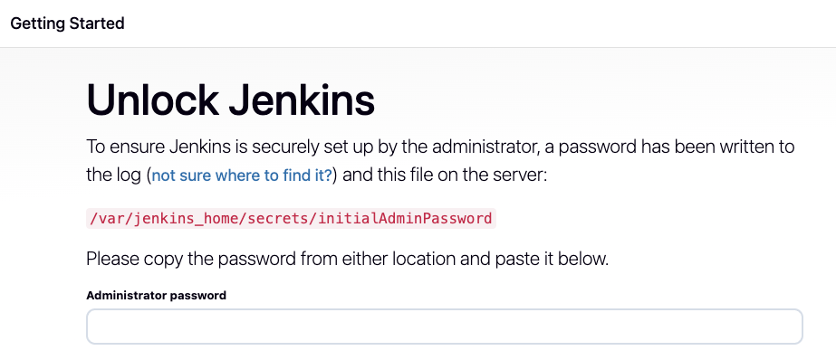
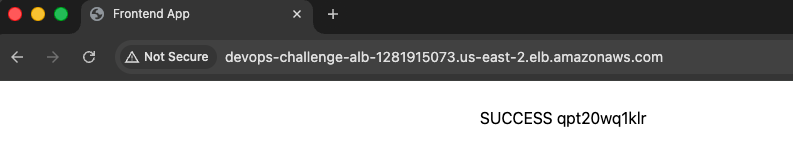
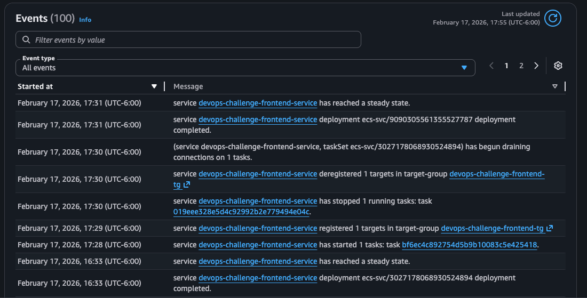
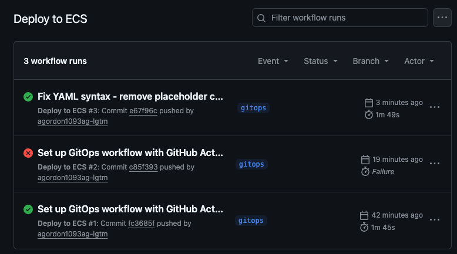

# Tech Challenge 1 — Full-Stack App Deployment on AWS ECS (Fargate)

A containerized full-stack application (React frontend + Node.js backend) deployed to **AWS ECS Fargate** using **Terraform** for infrastructure provisioning and a **Jenkins CI/CD pipeline** for automated build, push, and deployment. Includes a bonus **GitOps pipeline** using GitHub Actions with OIDC authentication, plus load testing and auto-scaling validation.

## Architecture



**Request flow:** User → Application Load Balancer → ECS Fargate services (frontend/backend) running in a VPC. Container images are built and pushed to Amazon ECR, ECS pulls the latest images on deploy, CloudWatch tracks CPU utilization to drive auto scaling, and Jenkins (or GitHub Actions, via the GitOps path) handles the build/deploy pipeline.

## Tech Stack

| Layer | Tools |
|---|---|
| Frontend | React |
| Backend | Node.js API |
| Containerization | Docker |
| Container Registry | Amazon ECR |
| Orchestration | Amazon ECS (Fargate) |
| Networking | VPC, Application Load Balancer |
| Infrastructure as Code | Terraform |
| CI/CD | Jenkins (primary), GitHub Actions + OIDC (GitOps bonus) |
| Monitoring / Scaling | Amazon CloudWatch, ECS Application Auto Scaling |
| Load Testing | Siege |

## Repository Structure

```
.
├── backend/                # Node.js API + Dockerfile
├── frontend/                # React app + Dockerfile
├── terraform/                # IaC: VPC, ECS, ECR, ALB, IAM, autoscaling
├── .github/workflows/        # GitOps deployment workflow (bonus)
├── Jenkinsfile                # Jenkins pipeline definition
├── images/                    # Architecture diagram + screenshots
└── README.md
```

## Prerequisites

- AWS account with configured credentials (`aws configure`)
- Terraform CLI
- Docker
- Node.js
- An EC2 instance (or equivalent) for the Jenkins master, if using the Jenkins pipeline

## Local Setup & Application Validation

1. Clone the repository.
2. Install backend dependencies and start the backend service — verify it's running locally.
3. Point `frontend/src/config.js` to the local backend address.
4. Install frontend dependencies and start the frontend service — verify it loads successfully in the browser.



## Containerization

- Each service (frontend, backend) has its own `Dockerfile`.
- Images are built locally and validated with containers running side by side before anything is pushed to a registry.
- Container-to-container communication is verified locally prior to deployment.



## Infrastructure Provisioning (Terraform)

Terraform provisions the full AWS environment:

- VPC and networking resources
- ECS cluster (Fargate launch type)
- ECR repositories for frontend and backend images
- IAM roles, security groups, and CloudWatch monitoring
- Application Load Balancer
- Auto scaling configuration for Fargate services
- A Jenkins master server

```bash
cd terraform
terraform init
terraform plan
terraform apply
```

Resources are validated in the AWS Console after apply (ECS cluster, ALB DNS, VPC, and related services).



## CI/CD Pipeline (Jenkins)

1. Jenkins runs as a Docker container on the master EC2 instance.
2. Required plugins are installed and credentials are configured for AWS/ECR access.
3. A `Jenkinsfile` at the project root defines the pipeline (build → push to ECR → deploy to ECS).
4. A webhook triggers the pipeline automatically on new commits.



## Deployment & Validation

- Jenkins builds updated images and pushes them to the appropriate ECR repositories.
- ECS services are updated to run the latest task definitions.
- Frontend and backend `config.js` files are updated to point to the ALB DNS name instead of localhost, so the deployed app talks to the deployed backend.
- The application is validated end-to-end via the ALB DNS endpoint in a browser.



## Load Testing & Auto Scaling

Load testing (via Siege) was used to generate traffic against the deployed application, with ECS Application Auto Scaling monitored to confirm tasks scale up and down based on CPU utilization.



## Bonus: GitOps with GitHub Actions

An alternative, keyless CI/CD path was implemented alongside the Jenkins pipeline:

1. A `gitops` branch removes the Jenkinsfile in favor of a GitHub Actions workflow.
2. OIDC is configured between GitHub Actions and AWS, backed by a dedicated IAM role — no long-lived AWS access keys are stored in GitHub.
3. `.github/workflows/deploy.yml` defines the build-and-deploy workflow, triggered automatically on commit (or manually via the Actions tab).
4. The workflow deploys updated frontend/backend images to the same ECS cluster, validated via the ALB DNS endpoint.



## Security Notes

- AWS credentials are never committed to the repository; the pipeline uses IAM roles (and OIDC for the GitOps path) rather than static access keys where possible.
- Environment-specific values (ALB DNS names, endpoints, credentials) are kept out of version control and managed via Terraform variables / Jenkins credentials rather than hardcoded in source.

## Adding Screenshots & Diagrams

All visuals for this project live in `images/`. When adding new screenshots, follow the naming convention above (`screenshot-<section>.png`) so they map directly to the README sections, and keep the architecture diagram as `images/architecture-diagram.png`.
